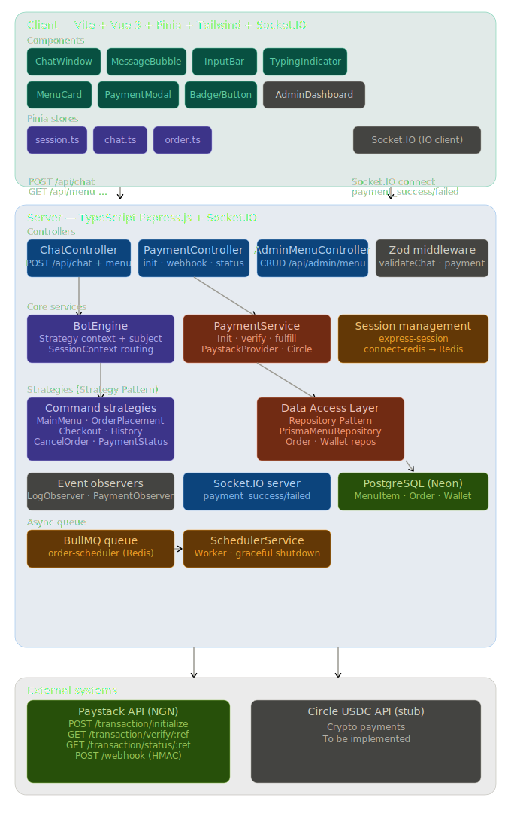

# Restaurant ChatBot

A conversational restaurant ordering system built with TypeScript, Express.js, Vue 3, and PostgreSQL. Users interact with a chatbot interface to browse menus, place orders, and pay via Paystack or Circle USDC.

## Architecture

### C4 Component Diagram


### Component Flow Summary

#### 1. Chat Flow

```
Frontend (POST /api/chat)
  ChatController (extracts message, builds SessionContext from Express session)
  BotEngine.handleInput() (resolves strategy based on session state + input)
  CommandStrategy.execute() (processes business logic, updates cart/state)
  BotEngine returns { messages, newState }
  ChatController saves session to Redis, returns response to frontend
```

**Conversation State Machine:**
```
main_menu --"1"--> browsing_menu --item#--> browsing_menu (add to cart)
browsing_menu --"99"--> checkout --"1" or "2"--> awaiting_schedule --minutes--> awaiting_payment
main_menu --"99"--> checkout
main_menu --"98"--> order_history --> main_menu
main_menu --"97"--> payment_status --> main_menu
main_menu --"0"--> cancel_order --> main_menu
```
**Patterns in play1:**
- **Strategy** — `BotEngine` delegates to the correct `CommandStrategy` based on session state, keeping the engine thin and open to new commands
- **Repository** — strategies read data through repository interfaces, not direct Prisma calls, enabling testability
- **Session Management** — `SessionContext` is extracted from Redis-backed `express-session` on every request, bridging anonymous sessions with durable order data


#### 2. Payment Flow

```
Frontend (POST /api/payment/initialize)
  -> PaymentController.initiatePayment()
  -> PaymentService.initiatePayment()
     -> WalletRepository.findOrCreateBySessionId()
     -> OrderRepository.createOrder(status: PENDING)
     -> createPaymentProvider() -> PaystackProvider.initializeTransaction()
     -> Returns authorization URL to frontend
  -> User completes payment on Paystack
  -> Paystack sends webhook (POST /api/payment/webhook)
  -> PaymentController.handlePaystackWebhook()
     -> Verifies HMAC-SHA512 signature from x-paystack-signature header
     -> PaymentService.fulfillSuccessfulPayment()
        -> PaystackProvider.verifyTransaction(reference)
        -> WalletRepository.creditBalance()
        -> WalletRepository.debitBalance()
        -> OrderRepository.updateOrderStatus(COMPLETED)
        -> BotEngine.notify("PAYMENT_SUCCESS", payload)
           -> PaymentObserver emits Socket.IO "payment_success" to client
  -> Frontend receives real-time notification
```
**Patterns in play2:**
- **Factory** — `createPaymentProvider()` selects Paystack or Circle based on order currency, isolating provider creation
- **Observer** — `BotEngine.notify("PAYMENT_SUCCESS")` fires to all registered observers without the payment service knowing about them
- **Security** — HMAC-SHA512 webhook signature verification before any state mutation; payment confirmed server-side, not client-side


#### 3. Real-Time Notification Flow

```
Socket.IO Server (maintains sessionSocketMap: sessionId -> socketId)
  <- Frontend connects with query: { sessionId }
  <- PaymentObserver listens for BotEngine.notify() events
  <- On "PAYMENT_SUCCESS" or "PAYMENT_FAILED":
     -> Looks up socketId from sessionSocketMap
     -> Emits "payment_success" or "payment_failed" to specific client
  -> Frontend Socket.IO client listens and updates UI
```
**Patterns in play3:**
- **Observer** — `PaymentObserver` reacts to `BotEngine` events and pushes to Socket.IO — decoupled from business logic
- **Session–Socket Mapping** — `sessionSocketMap` bridges the stateless HTTP session to a stateful WebSocket connection, enabling targeted real-time pushes to the correct client


#### 4. Scheduled Order Flow

```
CheckoutStrategy (during checkout)
  -> Asks user for schedule time (minutes or 0 for immediate)
  -> SchedulerService.scheduleOrder(orderId, scheduledAt)
     -> Calculates delay = scheduledAt - now
     -> Adds job to BullMQ "order-scheduler" queue
  -> BullMQ Worker processes job at scheduled time
     -> Checks if order exists and is COMPLETED
     -> (Placeholder for future fulfillment logic)
  -> Graceful shutdown: SchedulerService.dispose() closes queue + worker
```
**Patterns in play4:**
- **Strategy** — `CheckoutStrategy` handles scheduling as part of the checkout conversation flow
- **Singleton** — BullMQ queue and worker are module-level singletons with graceful shutdown via `SchedulerService.dispose()`
- **Async Decoupling** — scheduled orders are deferred via BullMQ in Redis, keeping the HTTP request cycle fast